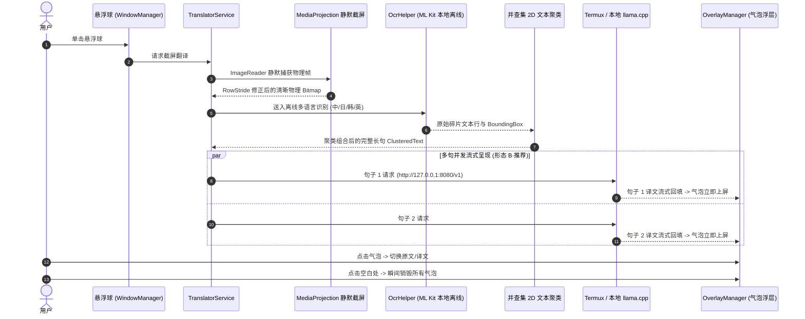

# 🎮 GameTranslator (屏幕截屏翻译器)

<div align="center">

[](https://github.com/wgj8471359-hash/GameTranslator/releases/latest)
-blue?style=flat-square&logo=android)


**极致轻量、零审查、真正的真·端侧离线截屏翻译神器。**  
支持手机端本地 Termux + llama.cpp 闭环运行，亦支持局域网/公网 OpenAI 兼容 API。

[多场景适用](#-全场景覆盖) • [核心特性](#-核心特性) • [架构图解](#-架构与处理流) • [Termux真·端侧部署](#-特色手机端侧纯离线部署-termux--llamacpp) • [操作说明](#-手势与交互说明) • [配置详解](#-核心配置项详解) • [下载与安装](#-下载与安装)

</div>

---

> [!NOTE]
> **写在前面（关于本项目）**：  
> 本项目的全部代码均由 AI 驱动开发，文档（包括本篇 README）亦由 AI 编写生成。本人完全不懂编程相关知识，纯粹是出于自己的日常使用需求，通过与 AI 协作对话一步一步迭代打磨出这款工具。若在使用中遇到任何 Bug 或有更好的改进建议，非常欢迎提交 Issue 指正交流！

## 💡 为什么需要 GameTranslator？

很多时候我们在手机上面对各种外语内容：未汉化的外语游戏、生肉漫画、海外社交媒体、外语文献或海淘 App。传统翻译工具通常有如下硬伤：
1. **全屏涂抹覆盖**：截图后直接贴一张静态大图，打断原本的动画或视频播放，交互极其割裂。
2. **多行断句倒装（SOV 语序破坏）**：韩语/日语等多行气泡如果被 OCR 拆成单行翻译，语序彻底崩塌，难以理解。
3. **云端审核与内容阉割**：部分小众题材、二次元剧情常被公网商业翻译接口当成“敏感词”误杀或拒答。
4. **网络依赖**：通勤地铁、弱网或离线环境下根本无法使用。

**GameTranslator** 采用 **「Google ML Kit 纯离线多语 OCR + 2D 并查集智能聚类 + Termux/局域网大模型流式回填 + 局部自适应半透明气泡」**，打造了一个**私密、轻便、零审查、不阻断屏幕画面**的万能截屏翻译浮层工具！

---

## 🌟 全场景覆盖

只要屏幕上能显示文字，轻轻一点悬浮球，即可极速识别并原位覆盖翻译：

| 适用场景 | 解决痛点 | 实际体验 |
| :--- | :--- | :--- |
| **🎮 外语游戏 (RPG / 视觉小说)** | 游戏画面保持动态渲染，不打断 Live2D 与背景音效；人名框与对话框自动分离开。 | 原文位置浮现半透明圆角气泡，点一下切原文，点空白处秒关闭。 |
| **📚 生肉漫画 / 电子书** | 日漫纵排横排多行台词分散，传统 OCR 乱序拼词。 | 并查集 2D 几何聚类合并为完整对白，流畅自然。 |
| **📱 海外社交 App (X / Reddit / Discord)** | 复制多段文字跳转翻译软件繁琐，跨国交流低效。 | 单击悬浮球直接就地覆盖显示中文，看完随手一点空白处关闭。 |
| **🛍️ 跨境海淘 / 小众外语应用** | 软件无中文语言包，按钮与菜单项分散。 | 界面多按钮同时聚类多行识别，快速看懂操作项。 |

---

## ✨ 核心特性

- 📱 **真·手机端完全离线闭环 (Termux + llama.cpp)**：
  - 首发深度优化**手机本机 Termux + llama.cpp 端侧直连**方案（直接监听 `http://127.0.0.1:8080/v1`）。
  - 无需电脑、不占局域网、不花流量，真正做到飞机/地铁离线即开即用！
- 🔒 **零审查与隐私安全**：
  - OCR 基于 Google ML Kit，纯本地离线推理，绝不上报截图数据；
  - 翻译直连私有部署的大模型（如 Tencent Hunyuan-MT2、Qwen 等），无敏感词过滤，原汁原味呈现。
- 🧩 **2D 空间并查集（Union-Find）几何聚类**：
  - 彻底抛弃低效生硬的“单向 Y 轴排序”，采用基于行高比率与水平投影容差的 2D 并查集图论算法；
  - 自动将同一气泡内的碎片折行聚合成完整长句，精准分离独立角色名与主句。
- 💬 **轻量级局部自适应浮层（不卡屏、不挡操作）**：
  - 仅在文字原位置精准叠加深色半透明圆角气泡，自适应字号（8~16sp）自动充满原框；
  - **双向切换**：轻触单个气泡可在「译文」与「原文」间秒切；轻触屏幕任意空白区域立即瞬间撤销所有浮层。
- ⚡ **双形态流式逐句上屏**：
  - **形态 B（推荐·小模型神器）**：多句并发独立流式，句子随出随显，大幅缩短等待时间，小参数模型（如 1.8B）极其稳健。
  - **形态 A（合并流式）**：单请求按结构化编号 `[1]...[2]...` 增量流式解析。
- 🌐 **全语种混合离线识别**：
  - 支持 **中日韩英全能自动融合识别**（自动去重与并集交并比合并）。
  - 支持单语种锁定：日语专选、韩语专选、中文专选、英语/拉丁语专选。
- 🛡️ **Android 14+ 系统级底层适配**：
  - 完美适配 Android 14 `MediaProjection` 强制注册 Callback 机制，杜绝崩溃。
  - 严格计算物理屏幕缓冲区行步长（`RowStride`），杜绝截图斜向花屏。
  - 刘海屏 `LAYOUT_IN_DISPLAY_CUTOUT_MODE_SHORT_EDGES` 沉浸式对齐，气泡坐标与截屏 1:1 绝对重合。

---

## 📐 架构与处理流



---

## 📱 特色：手机端侧纯离线部署 (Termux + llama.cpp)

> 无需电脑或局域网 Wi-Fi，一部手机即可独立搞定。

### 1. 准备 Termux 环境
在手机上安装 [Termux (推荐从 F-Droid 或 GitHub 下载)](https://github.com/termux/termux-app/releases)：
```bash
# 更新源并安装构建依赖
pkg update -y
pkg install -y git clang cmake make
```

### 2. 编译并安装 llama.cpp
```bash
git clone https://github.com/ggerganov/llama.cpp
cd llama.cpp
mkdir build && cd build
cmake .. -DGGML_OPENMP=ON
make -j$(nproc) llama-server
```

### 3. 启动本地翻译服务
将适合手机端运行的 GGUF 翻译模型（如 **`hy-mt2-1.8b-Q4_K_M.gguf`** 或 **`Qwen2.5-1.5B/3B`**）放到存储卡或 Termux 目录中：
```bash
# 启动本地 OpenAI 兼容服务（后台运行）
./bin/llama-server \
  -m /sdcard/Download/hy-mt2-1.8b-Q4_K_M.gguf \
  --host 127.0.0.1 \
  --port 8080 \
  -c 4096 \
  -t 4
```
> [!TIP]
> - 在 Termux 中运行 `termux-wake-lock`，防止手机锁屏或切换后台时被系统休眠 CPU。
> - 在 GameTranslator App 中，API 端点填写默认的：`http://127.0.0.1:8080/v1` 即可完美秒通！

---

## 💻 局域网 / PC 端部署方案（备用选择）

如果希望使用更大参数模型（如 `hy-mt2-7b` 或更高的模型），可在电脑端运行并通过局域网直连：

### vLLM 部署示例
```bash
python3 -m vllm.entrypoints.openai.api_server \
    --model tencent/hy-mt2-1.8b \
    --port 8080 \
    --host 0.0.0.0 \
    --trust-remote-code
```
- 手机端 API 端点填写局域网 IP：`http://192.168.x.x:8080/v1`。
- 如果通过 USB 连接手机，可运行 `adb reverse tcp:8080 tcp:8080`，手机端直接填 `http://127.0.0.1:8080/v1`。

---

## 🎮 手势与交互说明

| 手势 | 作用对象 | 功能描述 |
| :--- | :--- | :--- |
| **单击** | 悬浮球 | 触发全屏静默截屏、OCR、长句聚类与翻译，原位弹出半透明气泡 |
| **双击** | 悬浮球 | 快速调出 App 主配置设置界面 |
| **长按拖动** | 悬浮球 | 自由拖拽至屏幕任意位置，松手后自动贴靠最近侧边缘 |
| **点击气泡** | 任意翻译气泡 | 在「中文译文」与「原文字幕」之间即时来回切换 |
| **轻触空白处** | 任意非气泡区域 | 立即移除所有悬浮气泡，瞬间释放触控，不影响游戏/看漫下一步操作 |

---

## ⚙️ 核心配置项详解

打开应用主界面，可对以下核心参数进行微调（支持随时一键**恢复官方推荐配置**）：

### 1. 大模型 API 与流式配置
- **API 端点 (Base URL)**：OpenAI 兼容端点，默认 `http://127.0.0.1:8080/v1`。
- **API Key**：可选。本地/Termux 无鉴权端点可留空。
- **模型名称**：默认 `hy-mt2-1.8b`。
- **Temperature / Top P**：推荐 `0.7` / `0.6`（混元翻译官方推荐最佳生成参数）。
- **呈现形态**：
  - **形态 B（默认推荐）**：逐句独立流式并发。每个气泡框独立发请求，随出随填，有效防止漏译和超时。
  - **形态 A**：单请求合并流式，适合算力极充裕的服务端。

### 2. OCR 聚类与抗噪设置
- **OCR 识别语言**：
  - `自动融合 (中日韩英全能识别·推荐)`：同时跑多语言通道并自动空间并集去重，混合排版不漏字。
  - `韩语` / `日语` / `中文` / `英语·拉丁`：单语种锁定，降低运算负担。
- **行距容差倍率 (默认 1.2)**：垂直方向判定同一气泡句子的最大倍数。
- **最小保留字数 (默认 2)**：过滤画面噪点、小图标引起的无意义单字。
- **水平重叠容差 (默认 -20dp)**：多行文本在水平方向上的包容交错范围。

### 3. 悬浮球与气泡微调
- **悬浮球大小**：默认 `44dp`，不遮挡画面。
- **气泡不透明度**：默认 `85%`（深色质感，文字对比度极高）。
- **气泡字号自适应**：默认 `8sp ~ 16sp`，根据原文字矩形物理尺寸自动缩放。

---

## 📦 下载与安装

### 1. 直接下载正式发布版 APK (推荐)
请直接前往本仓库的 **[GitHub Releases 发布页面](https://github.com/wgj8471359-hash/GameTranslator/releases/latest)**：
- 下载最新的安装包，解压安装至手机即可即刻使用。

### 2. CI/CD 云端最新预览版 (开发尝鲜)
如果想体验尚未打 Tag 发版的最新提交（`main` 分支最新代码）：
1. 访问本仓库的 **[Actions 流水线页面](https://github.com/wgj8471359-hash/GameTranslator/actions)**。
2. 点击最近一次成功的构建任务（`Build & Sign Test APK`）。
3. 在页面底部的 **Artifacts** 列表直接下载 `GameTranslator-Signed-Test-APK`。

### 3. 本地编译与构建（开发者）
环境需求：JDK 17 + Android SDK (API 34)：
```powershell
# 编译 Debug 版本
gradle assembleDebug

# 编译 Release 版本
gradle assembleRelease
```

---

## 🛠️ 底层避坑说明（开发者必读）

1. **Android 14 MediaProjection 回调机制**：`createVirtualDisplay` 前必须调用 `registerCallback`，否则抛出 `IllegalStateException` 崩溃。
2. **RowStride 步长撕裂**：物理 Display 缓冲区的行步长与像素宽度不同步，必须动态计算 `rowPadding` 剪裁解码，避免斜向花屏。
3. **并查集 2D 聚类**：严禁单向 Y 轴排序，必须通过并查集处理空间二维投影重叠，避免人名、选项与对话框串行。
4. **WindowManager 全屏沉浸对齐**：使用 `FLAG_LAYOUT_NO_LIMITS` 并适配刘海屏 ShortEdges 模式，保证原图坐标与覆盖气泡 1:1 像素吻合。

---

## 📄 开源协议与免责声明

- **开源协议**：本项目基于 [GNU General Public License v3.0 (GPL-3.0)](file:///e:/workspace/GameTranslator/LICENSE) 协议开源。任何对本项目的修改、分发或衍生版本，均必须以相同的 GPL-3.0 协议保持完全开源，严禁闭源商业化包装。
- **免责声明**：本项目仅供个人日常辅助、无障碍阅读与移动端系统技术交流使用。
- **第三方依赖**：
  - OCR 引擎基于 Google ML Kit 本地离线组件；
  - 翻译大模型由使用者自行部署或配置，请遵循所使用开源模型（如 Tencent Hunyuan-MT、Qwen 等）对应的开源许可与当地法律法规。
